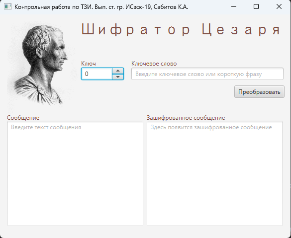
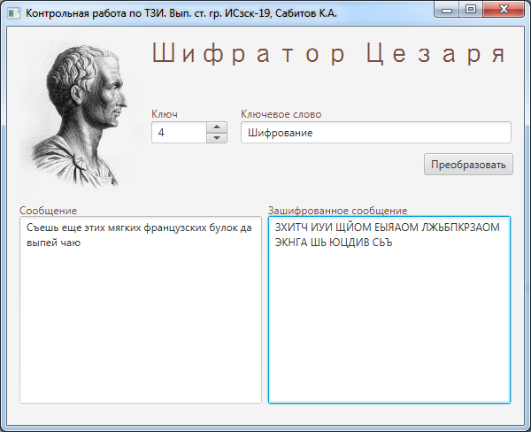
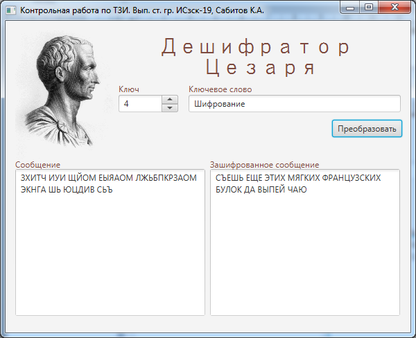

<a name="readme-top"></a>

<!-- PROJECT LOGO -->
<br />
<div align="center">
  <a href="https://donntu.ru/" target="_blank">
    
  </a>
  <h3 align="center">Caesar's encoder*</h3>
  <p align="center">
    Шифратор Цезаря
    <br>
  </p>
  <p align="right">
    <small><i>*Проект выполнен в рамках курса дисциплины «Технология защиты информации» в ходе обучения в
    <br>
    <strong>Донецком Национальном техническом университете</strong></i></small>
  </p>
</div>

## О проекте



Данный проект представляет собой контрольную работу на тему «Защита информации с помощью шифра «Цезаря с ключевым словом». Выполнена в ходе обучения в бакалавриате в ФГБОУ ВО ДонНТУ в 2021 году. Целью выполнения контрольной работы было изучение метода шифрования информации с помощью шифра Цезаря с ключевым словом. Основная задача контрольной работы заключалась в разработке программы, позволяющей шифровать и дешифровать информацию.

Проект содержит два модуля для шифрования и дешифрования информации. В проекте используется Stream API. [Подробнее про шифр Цезаря](https://neudoff.net/info/informatika/sistema-cezarya-s-klyuchevym-slovom/)

Реализация проекта выполнялась с использованием языка программирования Java и библиотекой для создания пользовательских интерфейсов JavaFX.

<p align="right">(<a href="#readme-top">наверх</a>)</p>

## Приступая к работе

Чтобы запустить локальную копию системы, выполните следующие простые действия.

### Компоненты

Убедитесь, что у вас установлены следующие компоненты:
* Oracle Java 9
* Apache Maven 3.9.8

### Установка
1. Клонируйте репозиторий
  ```sh
    git clone https://gitflic.ru/project/sabitovka/caesar-s-encoder.git
  ```
2. Выберите необходимый модуль
  ```sh
    cd Decryptor 
  ```
3. Скомпилируйте проект с помощью Maven
  ```sh
    mvn clean compile
  ```
4. Запустите систему
  ```sh
    mvn javafx:run
  ```
<p align="right">(<a href="#readme-top">наверх</a>)</p>

## Использование

Для шифрования информации используется модуль Encryptor. Выставьте значение ключа от 0 до 31 и введите ключевое слово. После в поле "Сообщение" введите Ваше сообщение для шифрования и нажмите на кнопку "Преобразовать". Результат будет записан в верхнем регистре и скопирован в буфер обмена. 



Для дешифрации используется модуль Decryptor, который позволяет по зашифрованному сообщению получить исходное. Для этого необходимо внести ключ и ключевое слово, которое было указано при шифровании.


 
<p align="right">(<a href="#readme-top">наверх</a>)</p>

## Вклад

Вклады - это то, что делает сообщество разработчиков с открытым исходным кодом замечательным местом для обучения, вдохновения и творчества. Я **высоко оценю любой ваш вклад**.
Если у вас есть предложения по улучшению системы, сделайте Форк и создайте Запрос на слияние. Также вы можете создать issue с тегом "enhancement"
1. Сделайте Форк проекта
2. Создайте новую ветку фичи (`git checkout -b feature/your-feature`)
3. Закоммитте изменения (`git commit -m 'Добавлена новая фича'`)
4. Запуште изменения (`git push origin feature/your-feature`)
5. Создайте запрос на слияние

<p align="right">(<a href="#readme-top">наверх</a>)</p>

## Лицензия

Распространяется по лицензии MIT. Дополнительную информацию смотрите в файле "LICENSE.txt`.

<p align="right">(<a href="#readme-top">наверх</a>)</p>

## Контакты
Карим Сабитов
* [VK](https://vk.com/id87074050)
* [karim.sab@yandex.ru](mailto://karim.sab@yandex.ru)

Другие ссылки на проект:
* GitHub - [https://github.com/sabitovka/caesar-s-encoder](https://github.com/sabitovka/caesar-s-encoder)
* GitFlic - [https://gitflic.ru/project/sabitovka/caesar-s-encoder.git](https://gitflic.ru/project/sabitovka/caesar-s-encoder.git)

<p align="right">(<a href="#readme-top">наверх</a>)</p>
